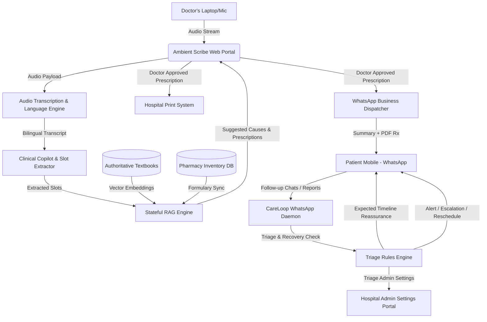

# Implementation Plan: AuraScribe & CareLoop

A clinical-grade, doctor-facing Ambient AI Medical Scribe coupled with a WhatsApp-based Automated Patient Retention and Follow-Up Loop, tailored for clinics and hospitals in Tamil Nadu, India.

---

## 1. Executive Summary & Vision

This system pivots the existing ENT RAG triage engine from a patient-facing web chatbot into a high-value B2B healthcare product designed to increase a hospital's business footprint, operational efficiency, and patient retention. 

### Core Workflow
1. **The Ambient Scribe:** During the outpatient consultation, a web application records conversation audio (with Start/Stop/Mute controls).
2. **The Clinical Copilot:** The AI transcribes the mixed-language conversation (English + Tamil / "Tanglish"), extracts clinical facts, and recommends possible causes (diagnoses) and prescription details—synchronized with live pharmacy inventory—grounded in authorized textbooks and formulary databases.
3. **The Human-in-the-Loop:** The doctor reviews, corrects, and signs off. Their corrections are logged as structured feedback to improve the model.
4. **The Patient WhatsApp Delivery:** Upon approval, a physical prescription is printed, and a beautifully structured medical summary + digital prescription is instantly dispatched to the patient's WhatsApp.
5. **The CareLoop (Automated Follow-Up):** The system automates WhatsApp-based check-ins. If a patient reports that symptoms are expected, the AI reassures them. If symptoms worsen or side effects emerge, the AI triggers a triage routine and guides them to schedule an in-clinic follow-up appointment.

---

## 2. System Architecture & Components

### Component A: Ambient Scribe Web Client (Doctor-Facing Portal)
An interactive React/Vite/Next.js dashboard loaded in the consulting room:
* **Audio Capture Controller:** Web Audio API client interfacing with internal/external microphones.
* **Recording State Controls:** Explicit UI buttons for **Start**, **Stop**, **Mute**, and **Unmute** recording.
* **Transcription Panel:** Displays live/batch-transcribed text (Tamil + English).
* **AI Copilot Sidebar:** 
  * **Suggested Causes:** Clickable clinical diagnoses with text-source citations.
  * **Prescription Interface:** Suggests medication names, strengths, frequencies, and durations. Displays green/red visual indicators for real-time pharmacy inventory availability.
  * **Interactive Editor:** Fully editable inputs allowing the doctor to correct or override any suggested text before finalization.

### Component B: Backend Services (FastAPI / Python)
* **Bilingual Speech-to-Text (STT) Service:** 
  * Optimized transcription for South Indian medical accents and mixed Tamil-English speech ("Tanglish").
* **Clinical Copilot Engine:** 
  * Refits the existing `TriageEngine` and `GeminiSlotExtractor` to parse doctor-patient conversations rather than direct patient questionnaires.
* **Authoritative RAG Router:**
  * Uses the existing `stateful_rag` framework. Queries the authoritative medical reference database (textbooks, hospital protocols) to ground the suggested causes and ensure zero-hallucination compliance.
* **Inventory & Pharmacy API Integration:**
  * Connects prescription recommendations to the hospital’s ERP/Pharmacy database to verify active stock.
* **Prescription Generator & Dispatcher:**
  * Generates clinical-grade PDFs and interfaces with the WhatsApp Business API to send interactive messages.

### Component C: CareLoop WhatsApp Daemon (Automated Follow-Up)
* **Outbox Scheduler:** Triggers automatic check-ins based on the medication duration and typical recovery curve (e.g., 3 days after an antibiotic course starts).
* **Inbox Triage Parser:** Reads patient text replies. Classifies responses into:
  1. *Expected Recovery:* Patient is recovering well.
  2. *Expected Side Effect/Timeline:* Reassures patient based on grounded guidelines (e.g., drowsiness from antihistamines).
  3. *Unsatisfactory Recovery / Adverse Reaction:* Patient is worsening or experiencing a severe side effect.
* **Clinic Rebooking Bridge:** Automatically generates an booking link for the outpatient clinic if the patient needs to return.
* **Admin Settings Engine:** A configuration portal allowing the hospital to toggle:
  * Max autonomous reassurance authority (which side effects the AI can reassure vs. must escalate).
  * Direct booking authorization.
  * Follow-up scheduler frequency.

---

## 3. Proposed Code Modifications & Extensions

### [NEW] `app/scribe/` - Ambient Scribe Module
* **`app/scribe/audio.py`**: Manages WebRTC or chunked audio upload, interfaces with bilingual STT models.
* **`app/scribe/processor.py`**: Extracts clinical slots from the doctor-patient dialogue transcript.

### [MODIFY] [guardrails.py](file:///Users/naveen/Documents/Documents/Projects/Medical-Rep-Outpatient/app/safety/guardrails.py)
* Add a **General Medical Emergency** regex filter (`cardiac_arrest`, `stroke_droop`, `chest_pain`, etc.) to run as the absolute first-line gate, bypassing specialized ENT checks to ensure maximum safety.

### [NEW] `app/careloop/` - WhatsApp Follow-Up & Rules Engine
* **`app/careloop/whatsapp.py`**: Integrates with WhatsApp Business API, sends templates, receives replies.
* **`app/careloop/triage.py`**: Triage parser evaluating patient check-ins. Compares reported symptoms/side-effects against the grounded recovery timeline of the original diagnosis.
* **`app/careloop/settings.py`**: Model for storing hospital configuration settings regarding AI decision-making limits.

---

## 4. Open Questions & Design Decisions

> [!IMPORTANT]
> Please review and clarify the following operational and technical questions. Your feedback will guide the direct implementation of the prototype:

1. **Bilingual Speech-to-Text (STT) Strategy:**
   * Do we want to leverage a cloud-based service (e.g., Gemini's audio ingestion or specialized Google Cloud Speech-to-Text with Indian English/Tamil models) or run a local lightweight Whisper model optimized for South Indian medical speech?
2. **Pharmacy Inventory Database Integration:**
   * For the inventory sync prototype, should we mock a relational database (e.g., a simple PostgreSQL table of drug names, stock levels, and clinical indications) or construct an API client stub that matches standard Hospital Information Systems (HIS) used in Tamil Nadu (like Akhil, Caresoft, or local vendors)?
3. **WhatsApp Sandbox / API Choice:**
   * For the prototype demonstration, shall we use the **Twilio WhatsApp API Sandbox** or a mock WhatsApp message simulator to showcase the CareLoop automated follow-ups without needing an active Meta Business verification immediately?
4. **AI Autonomy Admin Settings:**
   * What default parameters should we expose on the settings page for the hospital? (e.g., *"Allow AI to reassure patient on expected mild side-effects [Yes/No]"*, *"Allow AI to directly schedule follow-up appointments [Yes/No]"*).

---

## 5. Verification & Testing Plan

### Automated Verification
* **Transcript Extraction Evaluator:** A test suite containing 15 mock doctor-patient consultations (including Tanglish inputs) to verify that the Slot Extractor accurately captures the primary symptom, diagnosis, and prescription details.
* **CareLoop Triage Simulator:** Unit tests verifying that the WhatsApp Triage engine correctly classifies follow-up responses (e.g., "I feel sleepy after my cold medicine" $\rightarrow$ Reassure; "I have an itchy red rash all over" $\rightarrow$ Escalate).

### Manual Demonstration Flow
1. **The Consult:** Start recording in the Scribe Portal, simulate an outpatient dialogue (e.g., ear pain consult), and stop.
2. **The Copilot Review:** Verify that the system recommends the correct cause (Otitis Externa), suggests the standard prescription (Ear drops), and shows active inventory stock.
3. **The Approval:** Confirm the prescription and verify that the physical print command is sent and the patient receives a structured PDF summary on their WhatsApp.
4. **The Loop:** Trigger a mock post-3-day follow-up. Reply with a severe symptom, and verify that the AI initiates an urgent follow-up booking process.

---
